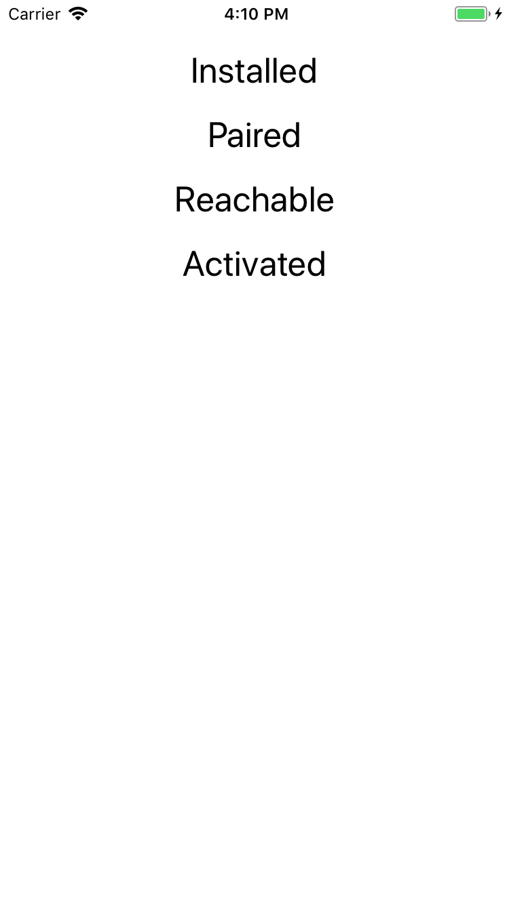

# HeartHarness
App to test WatchOS reachability.

This App isolates a bug in WatchConnectivity where an installed WatchOS App is never flagged as "reachable" in its counterpart iOS App.

If you run this App in the simulator, you will see the following screen:

However, if you run it on a real device, the App never becomes "Reachable".
This prevents messages from being sent to the watch and vice versa.

This bug showed up in iOS 11.0 and watchOS 4.0.

It was fixed in iOS 11.1 and watchOS 4.1.

It is broken again in iOS 11.2 and watchOS 4.2.
